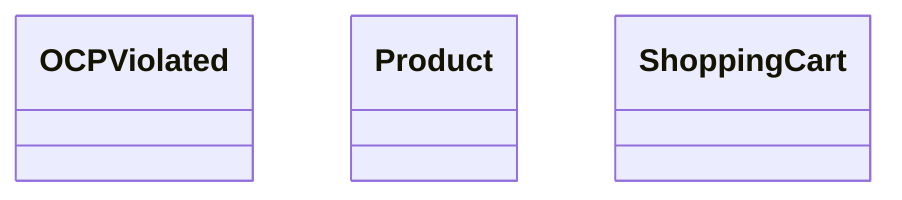

# Open–Closed Principle (OCP) 🚀

## 1) Executive Summary
- **What**: Software entities (classes, modules, functions) should be **open for extension** but **closed for modification**. ✨
- **Why**: Add new behavior via **new code** (subclasses/strategies), not by **editing** stable, tested code. This reduces regressions and speeds delivery. ⚡
- **Where in repo**:
  - **Bad example**: `OCPViolated.java`
  - **Good example**: `OCPFollowed.java`

---

## 2) Definition
> A module is **open for extension** (we can add new behavior) but **closed for modification** (we don’t rewrite existing, verified code to do it). 🔒➕

---

## 3) Importance
- **Stability**: Avoids touching proven code when adding features ✅
- **Safety**: Fewer merge conflicts and regressions 🛡️
- **Scalability**: Easy to plug-in new variants (strategies/adapters) as the domain grows 📈
- **Testability**: New variants can be tested in isolation 🧪

---

## 4) Symptoms of Violation (What to Look For)
- Large **switch/if-else** over “type”/“kind” (e.g., `switch(type)` or `if (x instanceof Y)`).
- You must **edit a core class** each time a new variant appears.
- Tight coupling between **decision logic** and **variant-specific behavior**.
- Fragile code with **shotgun surgery** whenever a new scenario is introduced. 🔧

---

## 5) “Wrong” Implementation (from the repo)

### Only the methods that violate OCP

**File**: `OCPViolated.java`

```java

// ❌ Violates OCP as every time we want to add a new storage, we have to modify this class.
// This class has multiple reasons to change.
record SaveProductToDB(ShoppingCart cart) {

    // ❌ saveToSql method violates OCP
    public void saveToSql() {
        cart.getProducts().forEach(p ->
                System.out.println("Product : " + p.name + " with price: " + p.price + " saved to SQL DB."));
        System.out.println();
    }

    // ❌ saveToMongo method violates OCP
    public void saveToMongo() {
        cart.getProducts().forEach(p ->
                System.out.println("Product : " + p.name + " with price: " + p.price + " saved to MongoDB."));
        System.out.println();
    }

    // ❌ saveToFile method violates OCP
    public void saveToFile() {
        cart.getProducts().forEach(p ->
                System.out.println("Product : " + p.name + " with price: " + p.price + " saved to File Path."));
    }
}

public class OCPViolated {
    public static void main(String[] args) {
        ShoppingCart cart = new ShoppingCart();

        cart.addProduct(new Product("Laptop", 50000));
        cart.addProduct(new Product("Mouse", 2000));

        ShoppingCartPrinter printer = new ShoppingCartPrinter(cart);
        printer.printInvoice();

        // ❌ violates OCP
        System.out.println("--- Saving Products ---");
        SaveProductToDB saveProduct = new SaveProductToDB(cart);
        saveProduct.saveToSql();
        saveProduct.saveToMongo();
        saveProduct.saveToFile();
    }
}

```

#### Why it violates OCP
- ❌ Central decision logic (e.g., `switch`/`if-else`/`instanceof`) forces **modification** of existing code for each new variant.
- ❌ Behavior for multiple variants is **hardcoded** into one place instead of being **delegated** to polymorphic types.
- ❌ Inhibits independent evolution and unit testing for each variant.

#### Respective Class Diagram (Before) — with interactions

## 6) Refactoring Objectives
- Introduce **abstractions** (🧩 interface/abstract class) to define the **extension point**.
- Move variant-specific behavior into **concrete implementations** (strategy/policy). 🧱
- Make the **client depend on the abstraction**, not concrete variants (DIP). 🔗
- Add a **factory/registry** if needed to obtain the correct implementation without branching. 🏭

---

## 7) “Right” Implementation (refactored)

### Only the methods that previously violated OCP (now isolated/extended)

**File**: `OCPFollowed.java`

```java
// ✅ implemented OCP & reason – extension contract (interface)
interface SaveProduct {
    void save();
}

// ✅ Follows OCP as we can add new storage classes without modifying existing ones.
record SaveProductToSqlDB(ShoppingCart cart) implements SaveProduct {
    @Override
    public void save() {
        cart.getProducts().forEach(p ->
                System.out.println("Product : " + p.name + " with price: " + p.price + " saved to SQL database."));
    }
}

// ✅ Follows OCP as we can add new storage classes without modifying existing ones.
record SaveProductToNoSqlDB(ShoppingCart cart) implements SaveProduct {
    @Override
    public void save() {
        cart.getProducts().forEach(p ->
                System.out.println("Product : " + p.name + " with price: " + p.price + " saved to NoSQL database."));
    }
}

// ✅ Follows OCP as we can add new storage classes without modifying existing ones.
record SaveProductToFile(ShoppingCart cart) implements SaveProduct {
    @Override
    public void save() {
        cart.getProducts().forEach(p ->
                System.out.println("Product : " + p.name + " with price: " + p.price + " saved to file."));
    }
}

public class OCPFollowed {
    public static void main(String[] args) {
        ShoppingCart cart = new ShoppingCart();

        cart.addProduct(new Product("Laptop", 50000));
        cart.addProduct(new Product("Mouse", 2000));

        // Print Invoice
        ShoppingCartPrinter printer = new ShoppingCartPrinter(cart);
        printer.printInvoice();
        System.out.println("Total: Rs " + cart.calculateTotal());

        System.out.println("--- Saving Products ---");

        // ✅ implemented OCP
        // Save to SQL DB
        SaveProductToSqlDB saveToSql = new SaveProductToSqlDB(cart);
        saveToSql.save();
        System.out.println();

        // Save to NoSQL DB
        SaveProductToNoSqlDB saveToNoSql = new SaveProductToNoSqlDB(cart);
        saveToNoSql.save();
        System.out.println();

        // Save to File
        SaveProductToFile saveToFile = new SaveProductToFile(cart);
        saveToFile.save();
    }
}
```

#### How the rewrite fixes it
- ✅ New behavior is added by **creating a new implementation** (class) rather than editing existing logic.
- ✅ The client collaborates with an **interface/abstract base**, so it’s **closed for modification** and **open for extension**.
- ✅ Factories/DI can supply implementations; no switch/if-else on types. 🙌

#### Respective Class Diagram (After) — with interactions

## 8) Design & Pattern Notes
- **Patterns**: Strategy / Policy, Factory, Abstract Factory, Template Method, Plugin/Registry. 🧠
- **Principles**: OCP pairs well with **DIP** and **SRP** to keep modules small and extensible. 🧭
- **Testing**: Contract tests for the abstraction; unit tests per implementation. 🧪

---

## 9) Trade-offs & Alternatives
- **Trade-off**: More classes/abstractions vs. easier extension and safer changes.
- **Alternative**: Data-driven configs to route to strategies; scripting/plugin frameworks if runtime extensibility is needed. 🧰

---

## 10) Migration/Adoption Guide
1. Identify conditional logic that selects among variants. 🔍
2. Extract an **interface/abstract base** for that behavior. ✂️
3. Move each case into a **separate implementation**. 🚚
4. Introduce **factory/DI** to assemble the right implementation. 🏗️
5. Add tests per implementation and a **contract test** for the abstraction. ✅

---

## 11) References
- Robert C. Martin — *Agile Software Development: Principles, Patterns, and Practices* (OCP) 📚
- Martin Fowler — *Refactoring* (Replace Conditional with Polymorphism, Strategy) 📖
- GoF — *Design Patterns* (Strategy, Factory Method, Abstract Factory, Template Method) 🏛️
