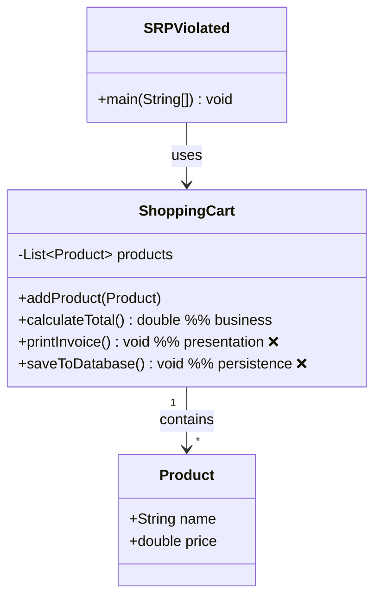
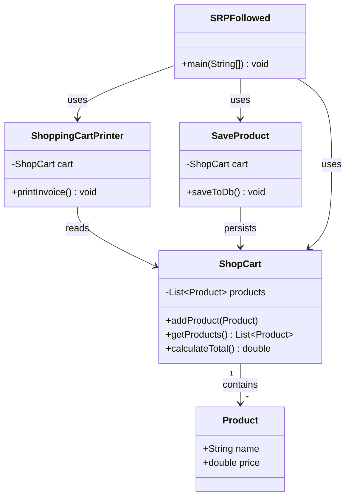

# SingleResponsibilityPrinicple.md

# Single Responsibility Principle (SRP)

## 1) Executive Summary
- **What**: SRP states that a class should have **one, and only one, reason to change**—i.e., one responsibility.
- **Why it matters**: Reduces ripple effects, improves testability, keeps changes small and localized, and accelerates team velocity.
- **Where in repo**:
  - **Bad example**: `SRPViolated.java`
  - **Good example**: `SRPFollowed.java`

---

## 2) Definition
> **Single Responsibility Principle (SRP)**: A module/class should be responsible for **one** area of functionality, and that responsibility should be **entirely encapsulated** by the class.

**Clarifications**
- SRP is about **cohesion** (one reason to change), not about class size or number of methods.
- Related ideas: **Separation of Concerns**, **High Cohesion**, **Low Coupling**.

---

## 3) Importance
- **Maintainability**: Changes to output format or persistence won’t risk breaking business rules (and vice versa).
- **Testability**: Independent responsibilities → focused unit tests, simpler test doubles.
- **Scalability & Reliability**: Enables independent evolution of concerns (e.g., new storage backend or new formatter) without churn elsewhere.
- **Team Velocity**: Fewer merge conflicts; clear ownership boundaries per class.

---

## 4) Symptoms of Violation (What to Look For)
- A single class handles **business rules**, **presentation/printing**, and **persistence/I/O**.
- Multiple **reasons to change** (e.g., DB schema changes, invoice layout changes, pricing rule changes) force edits in the same class.
- Hard-to-mock code due to direct I/O or database calls inside business classes.
- “Shotgun surgery”: One change requires touching many unrelated parts inside the same class.

---

## 5) “Wrong” Implementation (from the repo)

### Only the methods that violate SRP

**File**: `SRPViolated.java`

```java
// ❌ ShoppingCart mixes responsibilities (business logic + presentation + persistence)
class ShoppingCart {
    private final List<Product> products = new ArrayList<>();

    public void addProduct(Product p) {
        products.add(p);
    }

    // ✅ Business logic (OK to live here)
    public double calculateTotal() {
        double total = 0.0;
        for (Product p : products) total += p.price();
        return total;
    }

    // ❌ Presentation responsibility mixed into cart
    public void printInvoice() {
        System.out.println("----- Invoice -----");
        for (Product p : products) System.out.println(p.name() + " : " + p.price());
        System.out.println("Total: " + calculateTotal());
    }

    // ❌ Persistence responsibility mixed into cart
    public void saveToDatabase() {
        // Imagine JDBC/ORM code here
        System.out.println("Saving cart with " + products.size() + " items to DB");
    }
}
```

#### Why it violates SRP
- **`ShoppingCart.printInvoice()`** introduces **presentation/formatting** concerns into a business class.
- **`ShoppingCart.saveToDatabase()`** introduces **persistence/infrastructure** concerns into the same business class.
- The cart now has **three distinct reasons to change**: pricing rules (business), invoice layout (presentation), and database changes (infrastructure).

#### Respective Class Diagram (Before)


---

## 6) Refactoring Objectives
- Keep **business responsibility** (cart state + totals) in `ShoppingCart`’s domain successor (`ShopCart`).
- Extract **presentation** into a dedicated class (`ShoppingCartPrinter`) that depends on the cart but does not alter it.
- Extract **persistence** into a dedicated class (`SaveProduct`) that depends on the cart but isolates storage concerns.
- Make responsibilities independently evolvable and testable.

---

## 7) “Right” Implementation (refactored)

### Only the methods that previously violated SRP (now isolated)

**File**: `SRPFollowed.java`

```java
// ✅ Single responsibility: cart state + pricing
class ShopCart {
    private final List<Product> products = new ArrayList<>();

    public void addProduct(Product p) {
        products.add(p);
    }

    public List<Product> getProducts() {
        return products;
    }

    public double calculateTotal() {
        double total = 0.0;
        for (Product p : products) total += p.price();
        return total;
    }
}

// ✅ Single responsibility: presentation/formatting
class ShoppingCartPrinter {
    private final ShopCart cart;

    public ShoppingCartPrinter(ShopCart cart) {
        this.cart = cart;
    }

    public void printInvoice() {
        System.out.println("----- Invoice -----");
        for (Product p : cart.getProducts()) System.out.println(p.name() + " : " + p.price());
        System.out.println("Total: " + cart.calculateTotal());
    }
}

// ✅ Single responsibility: persistence
class SaveProduct {
    private final ShopCart cart;

    public SaveProduct(ShopCart cart) {
        this.cart = cart;
    }

    public void saveToDb() {
        // Imagine JDBC/ORM code here
        System.out.println("Saving cart with " + cart.getProducts().size() + " items to DB");
    }
}
```

#### How the rewrite fixes it
- **Presentation** (`ShoppingCartPrinter.printInvoice`) and **persistence** (`SaveProduct.saveToDb`) are separated from the **business** responsibility (`ShopCart.calculateTotal`).
- Each class has **one reason to change**:
  - `ShopCart`: cart rules and pricing changes.
  - `ShoppingCartPrinter`: invoice/formatting changes.
  - `SaveProduct`: storage/DB changes.

#### Respective Class Diagram (After)


---

## 8) Design & Pattern Notes
- **Separation of Concerns** and **High Cohesion**: Each class encapsulates exactly one concern.
- **Dependency Direction**: Business rules (`ShopCart`) do not depend on I/O or DB; presentation and persistence depend on the cart (not vice versa).
- **Open/Closed Principle (OCP) synergy**: Add new output channels (PDF/email) or repositories (JDBC/JPA/NoSQL) via new classes—**no modification** to `ShopCart`.
- **Testability**: 
  - `ShopCart` tests are pure and side-effect free.
  - `ShoppingCartPrinter` can be tested by capturing output or injecting a `Writer`.
  - `SaveProduct` can be tested with a mock/fake repository.

---

## 9) Trade-offs & Alternatives
- **Trade-off**: More classes and indirection vs. clarity and safe evolution.
- **KISS/YAGNI**: Don’t prematurely extract responsibilities you **don’t have**; split when a second concern appears or when tests become painful.
- **Alternative**: A thin façade (e.g., `ShoppingCartService`) may coordinate `ShopCart`, `ShoppingCartPrinter`, and `SaveProduct` if a simple entry point is desired, while preserving SRP inside.

---

## 10) Migration/Adoption Guide
1. **Identify mixed responsibilities** in existing classes (business + presentation + persistence).
2. **Extract** presentation and persistence into their own classes; keep the business class focused.
3. **Redirect callers** to use the new classes (optionally via a façade during transition).
4. **Add unit tests** per responsibility (business rules, formatting, persistence interaction).
5. **Remove legacy methods** from the original class once references are migrated.

---

## 11) References
- Robert C. Martin, *Agile Software Development: Principles, Patterns, and Practices* — SRP.
- Martin Fowler, *Refactoring* — Code smells & separation of concerns.
- Eric Evans, *Domain-Driven Design* — Entities vs. services and isolating domain logic.
